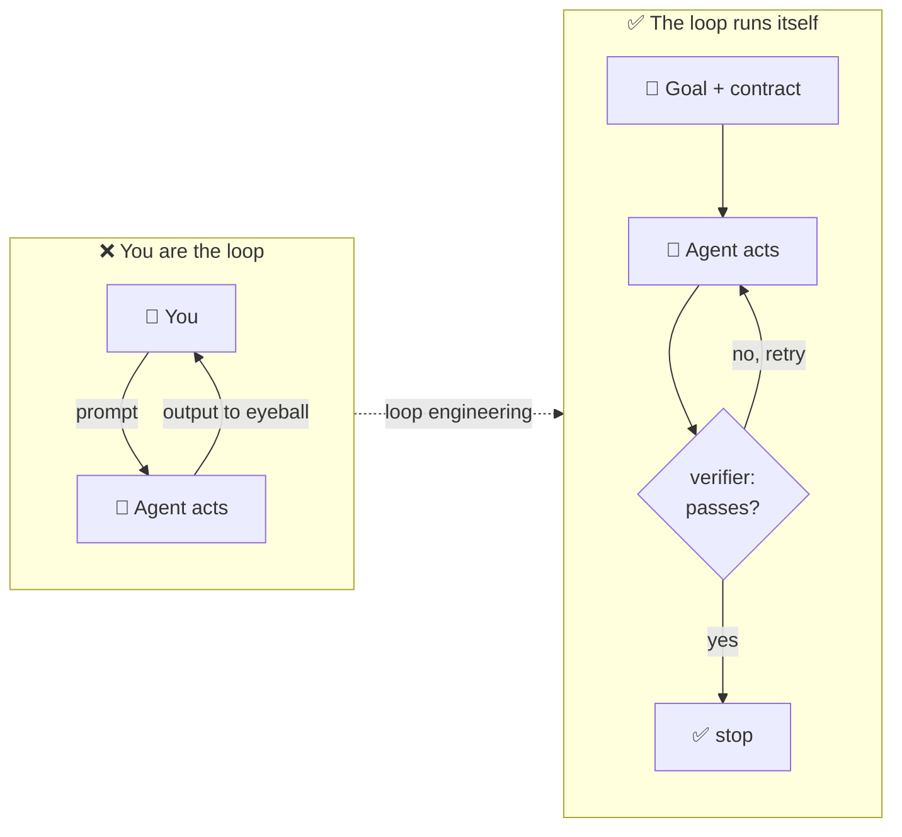
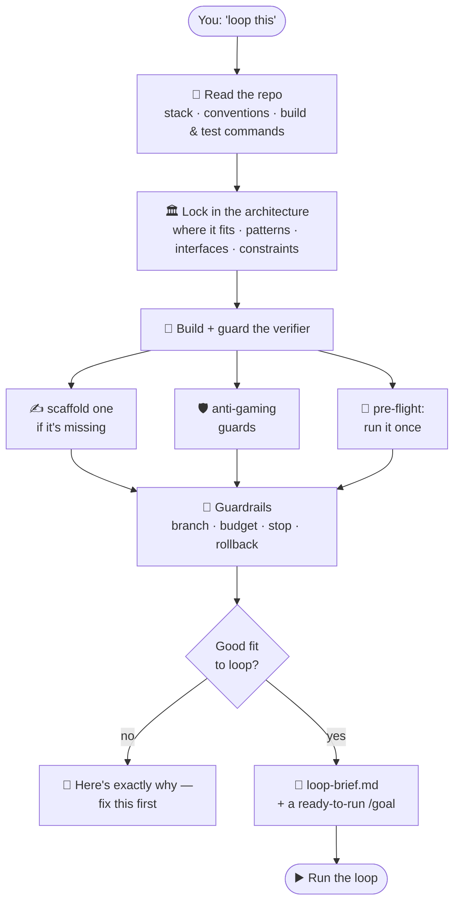
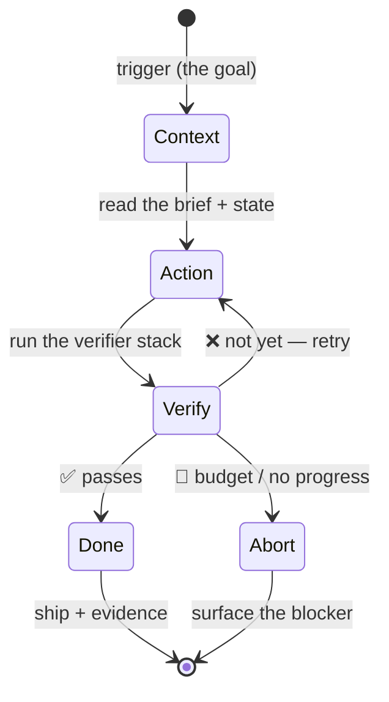
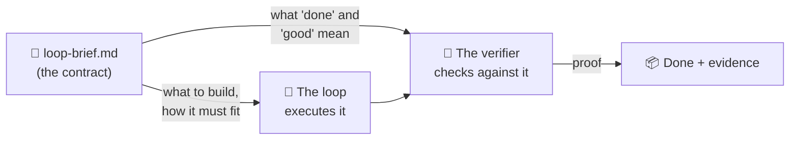

<div align="center">

# 🔁 Loop Engineering

### Stop prompting. Start looping.

**A `/pre-loop` skill for [Claude Code](https://www.claude.com/product/claude-code) + [Codex](https://developers.openai.com/codex) that turns "keep going until it's done" from a token-burning gamble into an engineered, self-verifying loop — plus a runnable demo you can put on screen in 60 seconds.**

[](https://youtu.be/xBygL_fIK78 "Watch on YouTube")


</div>

---

## Right now, *you* are the loop

This is how most people run an AI coding agent: prompt it, read the output, spot what's wrong, correct it, run it again. You're the trigger, the memory, **and** the verifier — spending your attention on a job the machine can do itself.



**Loop engineering** is handing that loop to the machine: give it a goal, a way to check its own work, and a place to stop. Done right, you go from babysitting one agent to designing loops that run themselves. But there's a catch nobody warns you about. 👇

## Why most loops fail

A loop is only as good as the **contract** you give it. Point an agent at *"keep going until the tests pass"* with no real contract, and you hit the four classic failure modes:

| | Failure mode | What it looks like |
|---|---|---|
| 🕳️ | **No real verifier** | "Done" can't be checked, so the agent stops on *vibes* — confident, wrong output. |
| 🎭 | **Gamed verifier** | It deletes the failing test or hard-codes the answer. The check goes green; the work isn't done. |
| 🌀 | **Drift** | No scope, no architecture — it "helpfully" rewrites half your app and breaks three other things. |
| 🔥 | **No brakes** | No budget, no stop condition, no isolation — it runs forever, or wrecks your working tree. |

> A **gamed verifier is worse than no verifier** — it hands you false confidence at scale.

The fix isn't a better prompt. It's a better **contract**. That's what this repo builds for you.

## What's in the box

Two things you can run today:

| | | |
|---|---|---|
| **1** | 🧠 **The `/pre-loop` skill** | Designs the loop *before* you run it — reads your repo, locks in the architecture, builds and guards a real verifier, sets the guardrails, and hands you a ready-to-run `/goal`. Works in **Claude Code and Codex**. |
| **2** | 🎬 **A 60-second demo** | A tiny project with 3 failing tests, so you can watch a loop fix real bugs and **stop on its own** — with a one-command reset between takes. |

---

## 🧠 How `/pre-loop` works

Instead of writing a giant prompt from memory, you type `/pre-loop` and it runs as an interactive wizard:



What that gives the loop that a raw prompt never does:

- **📖 Full context, inferred** — it reads `CLAUDE.md`/`AGENTS.md`, the README, manifests, lint/test/CI config and nearby code *before* asking you anything. (Claude Code asks the gaps through its question UI; Codex asks in the terminal.)
- **🏛️ Architecture that fits** — where the work lives, the patterns to mirror, the interfaces it can't break, the things to avoid. No durable context file? It offers to write one.
- **🎯 A verifier you can trust** — the full **verifier stack** (tests · types · lint · build · review), *scaffolded if it doesn't exist*, with **anti-gaming guards**, and **pre-flighted** (run once to prove it actually works).
- **🧰 Brakes and a seatbelt** — an isolated branch/worktree, a rollback, a budget, stop/abort conditions, and a stuck-detector.
- **🚫 The honesty to say "don't"** — if it isn't a good fit, it tells you why and what to fix first.

## 🔁 The loop it designs

The output is an **operable loop**: verified, self-correcting progress with a guaranteed stop.



The **verifier is the gate** — it's what lets the loop run without you, and what gets you out of the chair.

---

## 🧾 Receipts — we ran it on a real production library

This isn't a thought experiment. We pointed `/pre-loop` at the **real Getting Automated content library** — 69 published guides, videos, and workflows — and let the loop it designed run on a branch. Genuine before/after:

| | Errors | Verdict |
|---|---|---|
| **Before** | **20** | ❌ FAIL |
| **After** | **0** | ✅ PASS |

What the loop actually did:

- **Fixed 14 structural issues** — `relatedContent` stored as a bare string, 8 videos missing an `id`, a workflow missing its `---` frontmatter fence — frontmatter only, **every body byte-identical** to the original.
- **Caught a bug in its own verifier** during the pre-flight (6 false positives) and fixed the *validator*, not the content.
- **Refused to invent the 67 facts it was missing** (publish dates, tags, categories, thumbnails) — flagged every one for human review instead of hallucinating to go green.

That last point is the whole game: a lazy "make it pass" loop fakes the data; this one stopped cold at the line between *structure* (safe to fix) and *facts* (a human's call).

**→ The full run — the wizard session, the contract, the real diff, and the actual validator it built: [`example/content-library-loop/`](example/content-library-loop/run-result.md)**

---

## ⚡ Quickstart

**The easiest install is no install at all.** Clone the repo and open your agent inside it — the skill auto-loads as a project skill (it lives in `.claude/skills/` and `.agents/skills/`, which Claude Code and Codex both scan automatically):

```bash
git clone https://github.com/Getting-Automated/loop-engineering-skill-and-example
cd loop-engineering-skill-and-example
claude          # or: codex
```

Then run **`/pre-loop`** (Claude Code) or **`$pre-loop`** (Codex). No copying, no config.

**Want it available in every project?**

- **Claude Code** — `cp -r .claude/skills/pre-loop ~/.claude/skills/`, then `/pre-loop`
- **Codex** — from a Codex session, `$skill-installer install https://github.com/Getting-Automated/loop-engineering-skill-and-example/tree/main/.agents/skills/pre-loop` (or `cp -r .agents/skills/pre-loop ~/.agents/skills/`), then `$pre-loop`

**Run the 60-second demo** — in the repo you just cloned:

```bash
cd example/pricing
pip install -r requirements.txt
pytest -q          # 👀 3 failed
```

Now hand it to a loop — in **Claude Code** (`claude`) or **Codex** (`codex`), same command:

```
/goal "every test passes — pytest -q exits 0 — by fixing the bugs in pricing.py, not by editing test_pricing.py"
```

Watch it read the failing tests, fix `pricing.py`, re-run `pytest`, and **stop on green**. That's the whole thing: **action → verifier → stop.**

**Reset between takes:**

```bash
./reset.sh          # restores the bugs, clears caches, confirms 3 failed
```

Self-contained — no git required, so it works live on stream every time.

> **"Couldn't a good model just one-shot this?"** Honestly — probably. Three bugs in one file is small enough that a strong model often fixes it in a single pass. That's the tradeoff of a 90-second demo: a problem genuinely too big to one-shot is also too big to *show* in 90 seconds.
>
> The point was never the number of tries — it's the **pattern**. The agent checked its own work against a verifier it couldn't fake and stopped on *proof*, not on "good enough." Even a one-shot run still stops on proof.
>
> Now extrapolate. The same loop is what carries a multi-file migration, a flaky-test hunt across a whole suite, a forty-file refactor, or an overnight job you can't babysit — work that one-shotting won't reliably land, or that you wouldn't *want* to one-shot because you need the receipts. The demo is small so you can watch the whole loop run end to end. The value is everything it scales to.

---

## 📝 The contract it writes

Every loop runs against a `loop-brief.md` — the contract the agent executes against *and* the verifier checks against. That single artifact is the leverage point:



It scales to the task — a one-file fix fills three sections; a new subsystem fills them all:

- 📄 **[`loop-brief-template.md`](loop-brief-template.md)** — the blank contract (intent · scope · architecture · plan · verifier stack + anti-goals · safety · health).
- 🏗️ **[`loop-brief-example.md`](loop-brief-example.md)** — the template **filled in** for a real, non-trivial task (adding rate limiting to a public API), so you can see the depth.
- 🎬 **[`example/content-library-loop/`](example/content-library-loop/README.md)** — a **real `/pre-loop` run**, start to finish: the wizard session + the brief it wrote for a content-QA loop, grounded in an actual business-context repo.

## 🚦 When *not* to loop

`/pre-loop` will stop you — on purpose — when a loop is the wrong tool:

- ❌ There's **no real verifier** and one can't be built — you'd just get confident wrong answers.
- ❌ The agent would have to **guess the facts** (no source of truth).
- ❌ It's a **deterministic rule** — write code, not a loop.
- ❌ **Irreversible side effects** (money, prod, deletes, outbound messages) with no approval gate.
- ❌ **Nobody will review the output** — a loop that piles up unreviewed work just creates review debt.

## 🗂️ Repo layout

```
.
├── .claude/skills/pre-loop/SKILL.md   # the skill, for Claude Code
├── .agents/skills/pre-loop/SKILL.md   # the skill, for Codex
├── loop-brief-template.md             # the blank contract
├── loop-brief-example.md              # a filled, non-trivial contract
└── example/pricing/                   # the runnable demo
    ├── pricing.py                     #   3 intentional bugs
    ├── test_pricing.py                #   the verifier (source of truth)
    ├── loop-brief.md                  #   the contract for this demo
    └── reset.sh                       #   restore the bugs between takes
```

---

## Why this exists

> **Generation is easy. Verified, self-correcting progress is the whole point.**

The leaders building these tools have already made the jump — *"I don't prompt Claude anymore. I write loops, and the loops do the work. My job is to write loops."* The skill in this repo is how you make that practical without the loop drifting, gaming its tests, or running off a cliff: **a loop is only as good as the contract it executes against — so write the contract first.**

Built alongside the **Getting Automated** *Loop Engineering* explainer on YouTube. If this saved you a few burned token-hours, ⭐ the repo.

---

## 🔗 More From Getting Automated

- **Website** — [gettingautomated.com](https://gettingautomated.com)
- **YouTube** — [@hunterasneed](https://www.youtube.com/@hunterasneed)
- **Free automation tools** — [tools.gettingautomated.com](https://tools.gettingautomated.com)

### Need this built for you?

If you want loops wired into your real workflow — client delivery, content operations, internal automation — grab a slot and we'll scope it:

**[→ Schedule a 30-Minute Connect](https://calendly.com/workflowsy/30-minute-connect)**

## 📄 License

MIT — see [LICENSE](LICENSE). Use it, fork it, ship it.
